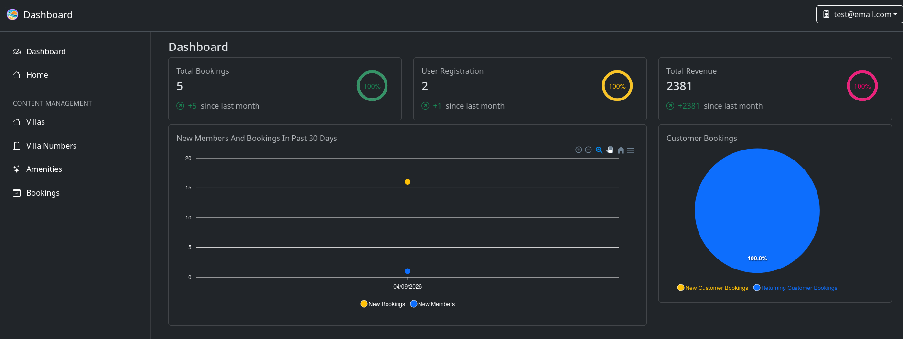
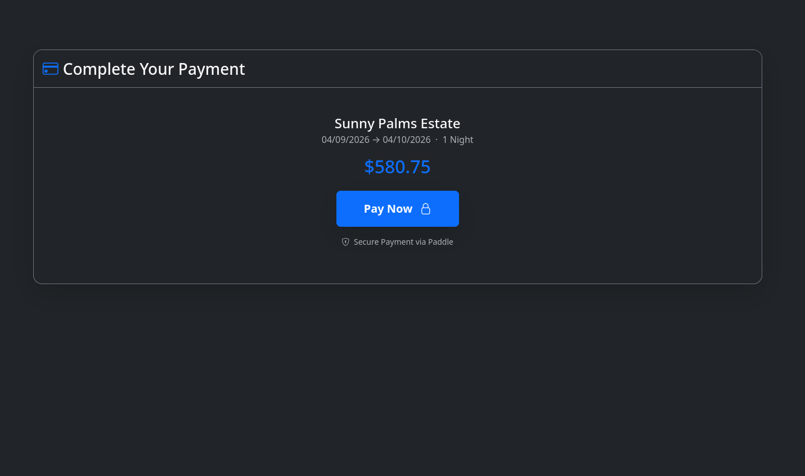
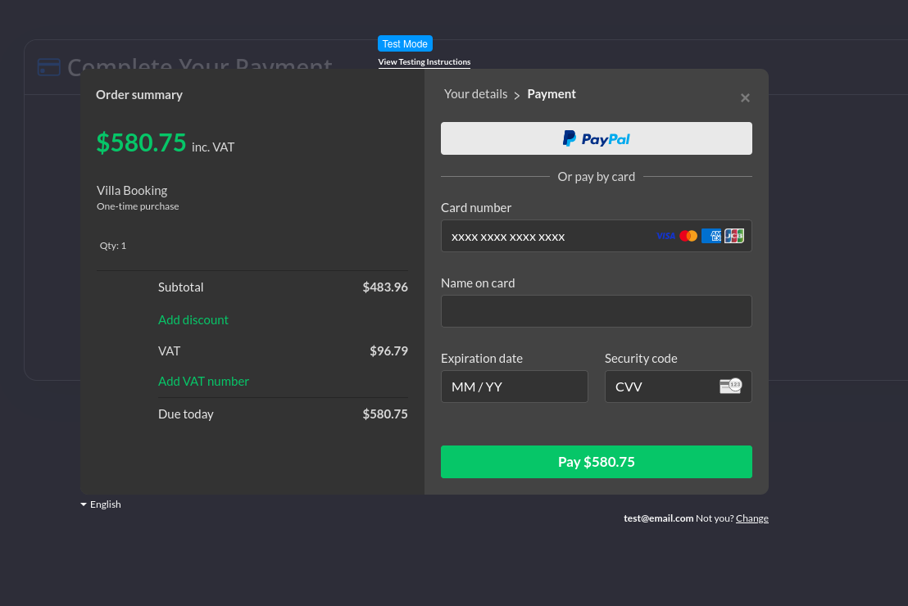
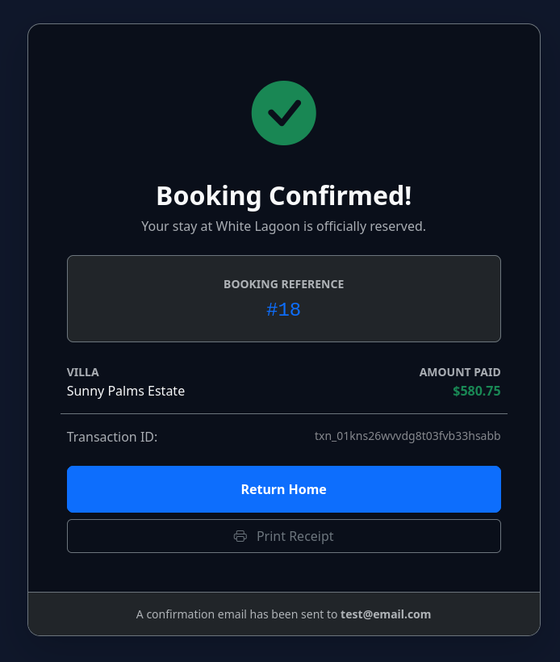
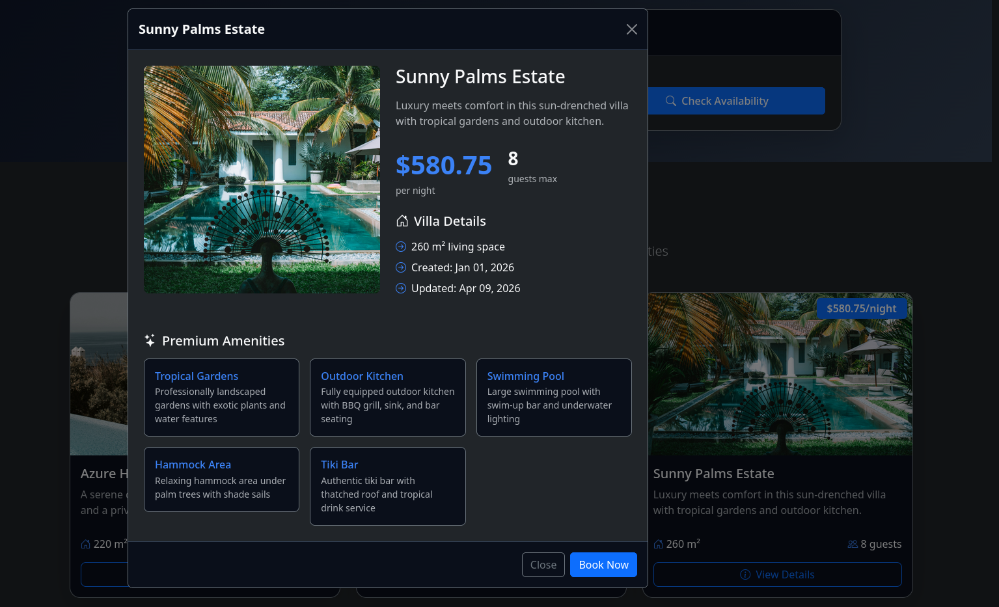
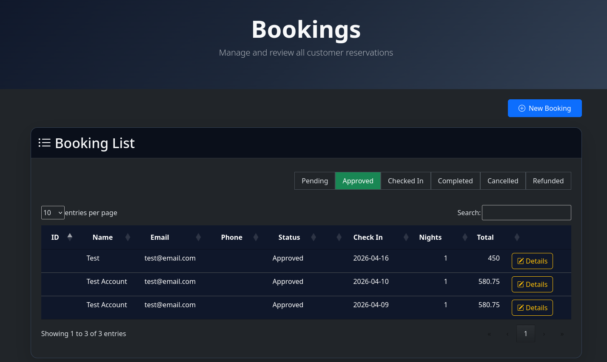
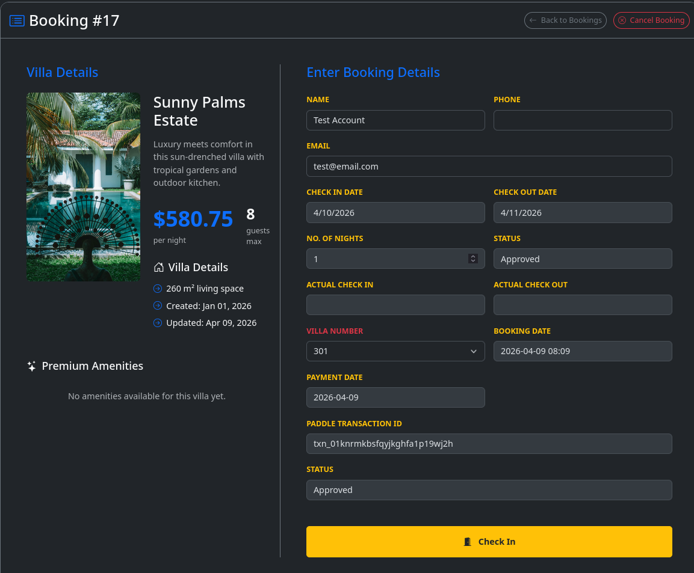

# 🌴 WhiteLagoon Villas
A full-stack luxury villa booking platform built with **.NET 10 MVC**, **PostgreSQL**, and **Onion Architecture**.  
Modern dark-themed UI, admin dashboard for managing villas/rooms/amenities, public booking flow with real payments, and responsive design.

## 📦 Technologies
- **Backend**  
  - .NET 10 (MVC)  
  - Entity Framework Core  
  - PostgreSQL  
  - Onion / Clean Architecture  
  - ASP.NET Identity (basic auth for admin)
  - Paddle Billing API (server-side payment integration)

- **Frontend**  
  - Razor Views + Bootstrap 5  
  - Custom CSS (dark modern theme)  
  - JavaScript & jQuery
  - ApexCharts (admin dashboard analytics)

- **Tools**  
  - dotnet CLI  
  - EF Core migrations  
  - User Secrets (for connection string + API keys)

## ✨ Features

### Public-facing
- Beautiful villa showcase grid with filters
- Availability checker (date + nights)
- Detailed villa view with amenities modal
- Full booking flow with secure payment via Paddle
- Booking confirmation screen

### Admin area (requires login)
- CRUD for Villas (create, edit, delete, upload image)
- Room inventory management per villa
- Amenity management (assign to villas)
- Booking management with status tracking (Pending → Approved → Checked In → Completed)
- Clean, dark-themed admin dashboard with live analytics

### Admin Dashboard (ApexCharts)
- **Total Bookings** radial KPI card with month-over-month comparison
- **User Registrations** radial KPI card with month-over-month comparison
- **Total Revenue** radial KPI card with month-over-month comparison
- **New Members & Bookings** line chart (past 30 days, two-series time series)
- **Customer Bookings** pie chart (new vs returning customers)

## 💳 Payment Integration

Payments are handled via **[Paddle Billing](https://www.paddle.com/)** (currently running in **sandbox mode**).

The integration follows a secure server-side flow — the browser never creates or controls the transaction:

```
Guest fills booking form
  → Server saves booking as Pending
  → Server creates Paddle transaction via API (secret key, never exposed to client)
  → Paddle overlay opens with server-created transaction
  → Guest pays
  → Server independently verifies payment status with Paddle API
  → Booking marked as Approved only after server-side confirmation
```

> ⚠️ **Sandbox mode**: No real money is charged. Use Paddle's test card details to complete a booking.

## 🚦 Running the Project Locally

1. **Clone the repository**

2. **Set secrets** (using User Secrets — recommended)

   ```bash
   dotnet user-secrets init
   dotnet user-secrets set "ConnectionStrings:DefaultConnection" "Host=localhost;Database=WhiteLagoon;Username=youruser;Password=yourpassword"
   dotnet user-secrets set "Paddle:ApiKey" "your_sandbox_secret_key"
   dotnet user-secrets set "Paddle:BaseUrl" "https://sandbox-api.paddle.com"
   ```

3. **Apply migrations**

   ```bash
   dotnet ef database update
   ```

4. **Run the application**

   ```bash
   dotnet run --launch-profile https
   ```
   → Open `https://localhost:7049` (or the port shown in the console)
   
   > HTTPS is required — Paddle enforces it even for local development.

5. **Optional: Create an admin user**
   - Register via `/Identity/Account/Register`
   - Manually assign the `Admin` role in the database

## 🖼️ Screenshots

### Admin – Dashboard & Navigation


### Booking – Complete Payment


### Booking – Payment (Paddle Sandbox)


### Booking – Confirmed


### Homepage – Hero & Villas Grid


### Availability Checker & Villa Cards


### Villa Details


### Booking – Finalize


### Booking – List & Management


### Booking – Details


### Admin – Villas Management


### Admin – Room Inventory


## 🧠 Architecture Highlights
- **Onion Architecture** — domain core independent of frameworks
- Clear separation: Application / Domain / Infrastructure
- Repository + Unit of Work pattern
- Dependency Injection throughout
- EF Core with fluent configuration
- Server-side payment verification — client is never trusted for payment status

## 💭 Possible Improvements
- Move Paddle from sandbox to live mode
- Add real image upload to cloud storage (Azure Blob, AWS S3, Cloudinary)
- Improve mobile experience for admin panels
- Add search/filter on public villa list
- Email confirmation after booking
- Calendar / real availability blocking
