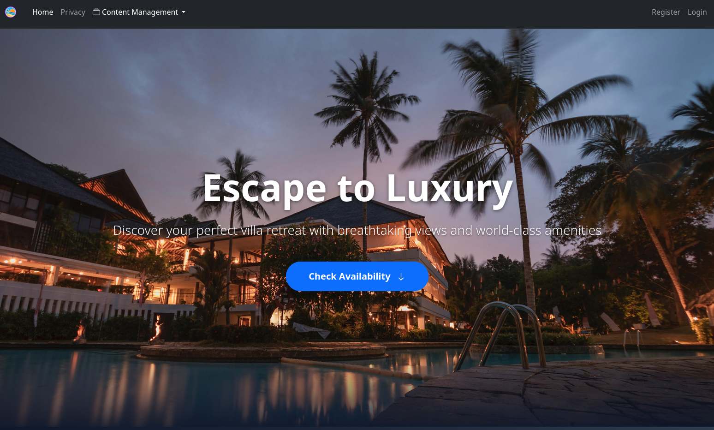
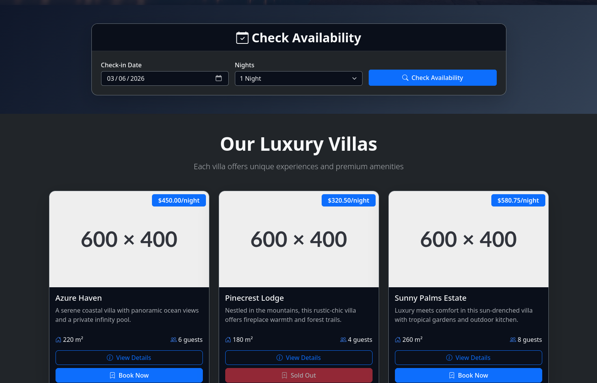
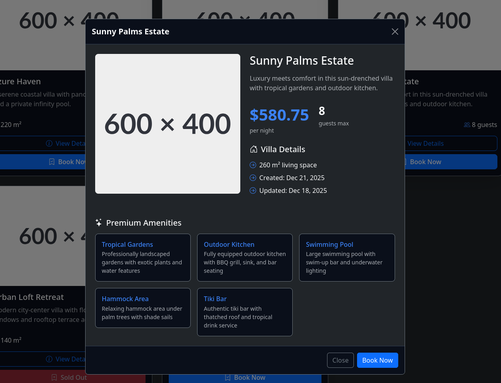
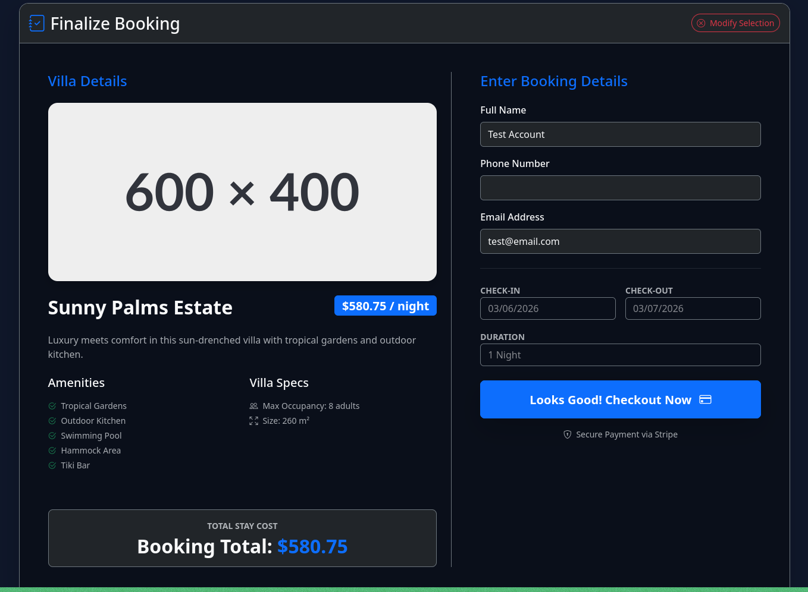
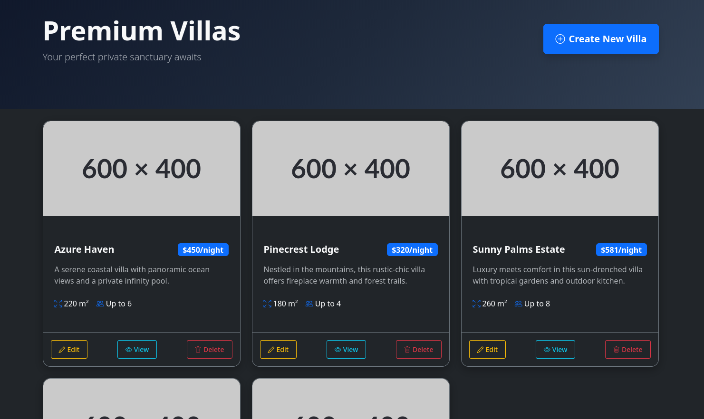
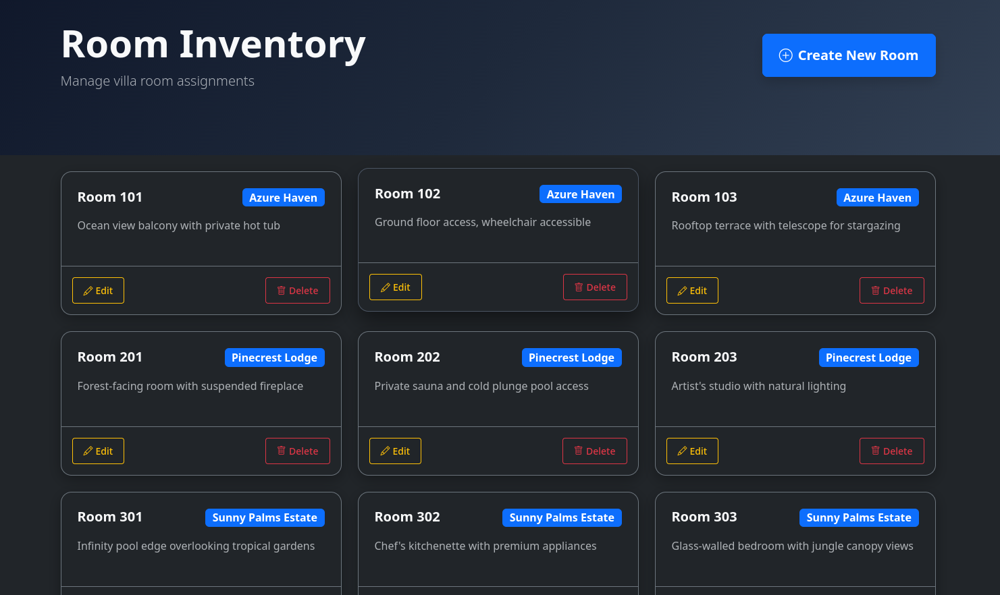

# 🌴 WhiteLagoon Villas

A full-stack luxury villa booking platform built with **.NET 10 MVC**, **PostgreSQL**, and **Onion Architecture**.  
Modern dark-themed UI, admin dashboard for managing villas/rooms/amenities, public booking flow, and responsive design.

> **Note:** The final checkout / payment step is intentionally **not functional** (Stripe is unavailable in the Isle of Man). The rest of the application (browsing, availability check, admin CRUD, booking summary) works end-to-end.

## 📦 Technologies

- **Backend**  
  - .NET 10 (MVC)  
  - Entity Framework Core  
  - PostgreSQL  
  - Onion / Clean Architecture  
  - ASP.NET Identity (basic auth for admin)

- **Frontend**  
  - Razor Views + Bootstrap 5  
  - Custom CSS (dark modern theme)  
  - JavaScript & some JQuery

- **Tools**  
  - dotnet CLI  
  - EF Core migrations  
  - User Secrets (for connection string)

## ✨ Features

### Public-facing
- Beautiful villa showcase grid with filters
- Availability checker (date + nights)
- Detailed villa view with amenities modal
- Booking summary page (pre-checkout)

### Admin area (requires login)
- CRUD for Villas (create, edit, delete, upload image)
- Room inventory management per villa
- Amenity management (assign to villas)
- Clean, dark-themed admin dashboard

## ⚠️ Current Limitations

- **Checkout / Payment** does **not** work (intentionally left unimplemented)  
  → Reason: Stripe is not supported in the Isle of Man.  
  The booking flow stops at the final confirmation screen.

## 🚦 Running the Project Locally

1. **Clone the repository**

   git clone https://github.com/YOUR-USERNAME/WhiteLagoon.git  
   cd WhiteLagoon

2. **Set the database connection string** (using User Secrets — recommended)

   `dotnet user-secrets init` 
   `dotnet user-secrets set "ConnectionStrings:DefaultConnection" "Host=localhost;Database=WhiteLagoon;Username=youruser;Password=yourpassword"`

   Replace postgres / yourpassword with your actual PostgreSQL credentials.

3. **Apply migrations** to create/update the database

   `dotnet ef database update`

4. **Run the application**

   `dotnet run`

   → Open https://localhost:5001 (or the port shown in the console)

5. **Optional: Create an admin user**

   - Register a user via the site /Identity/Account/Register  
   - Manually assign the Admin role in the Register section

## 🖼️ Screenshots

### Homepage – Hero & Villas Grid

### Availability Checker & Villa Cards

### Villa Details Modal

### Booking Summary (pre-checkout)

### Admin – Villas Management

### Admin – Room Inventory

## 🧠 Architecture Highlights

- **Onion Architecture** — domain core independent of frameworks
- Clear separation: Application / Domain / Infrastructure 
- Repository + Unit of Work pattern
- Dependency Injection everywhere
- EF Core with fluent configuration

## 💭 Possible Improvements

- Implement an alternative payment gateway available in Isle of Man (e.g. PayPal, local provider)
- Add real image upload to cloud storage (Azure Blob, AWS S3, Cloudinary)
- Improve mobile experience for admin panels
- Add search/filter on public villa list
- Email confirmation after booking
- Calendar / real availability blocking
- Role-based access control refinements
